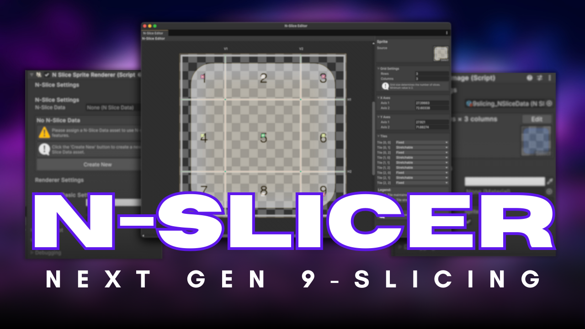
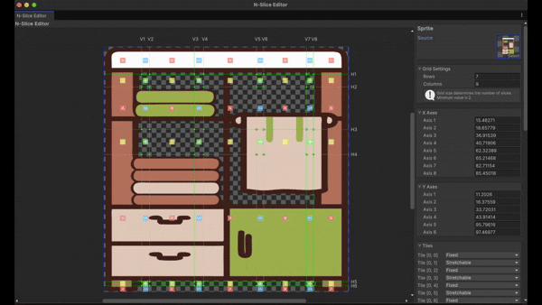
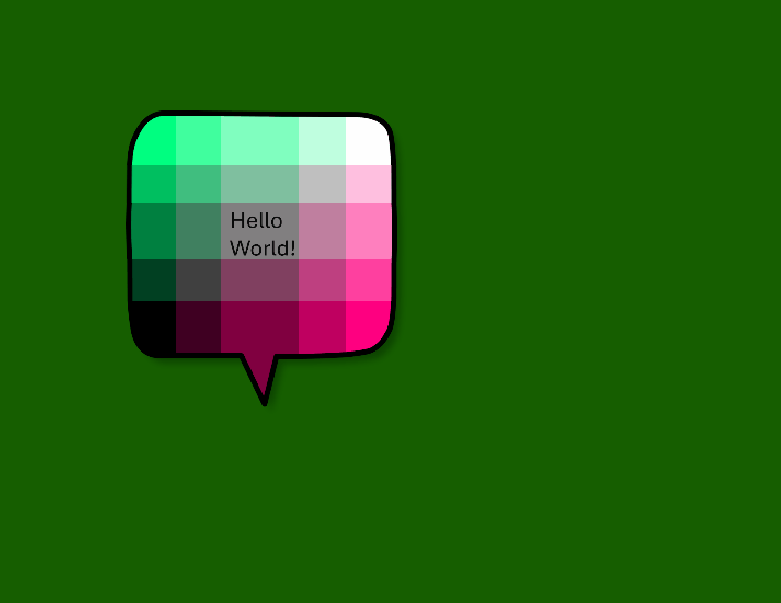
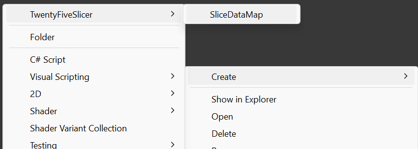
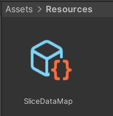
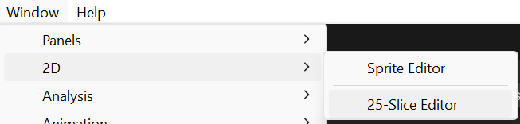
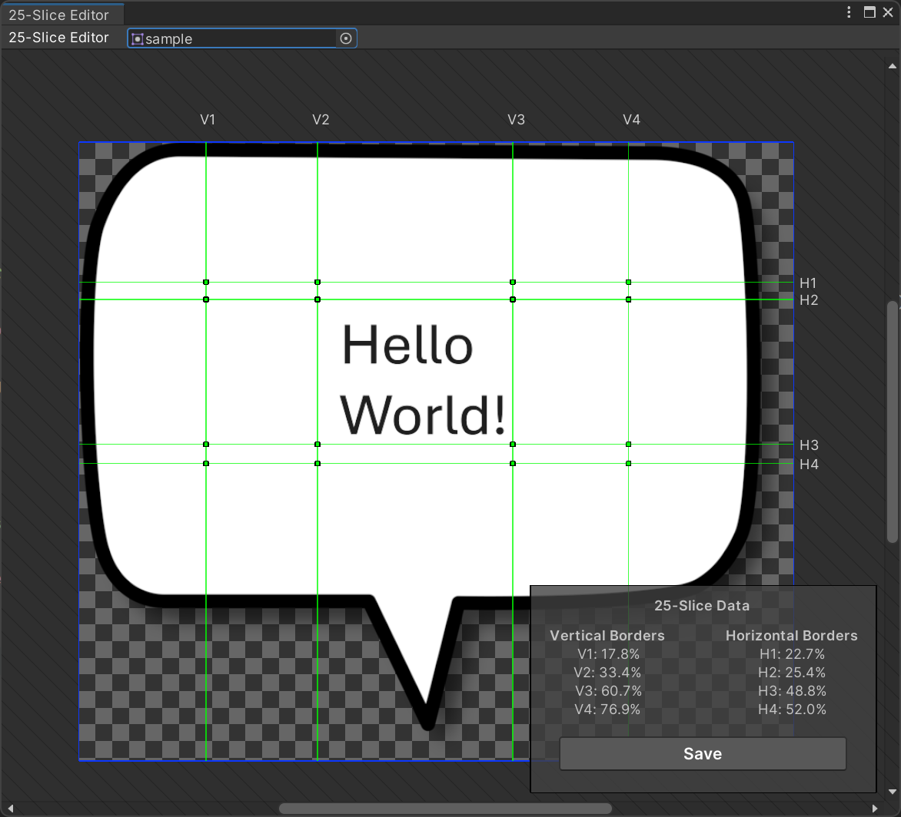
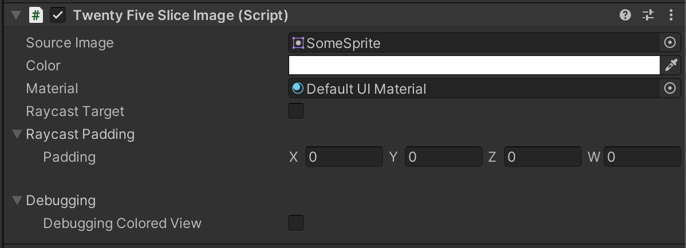
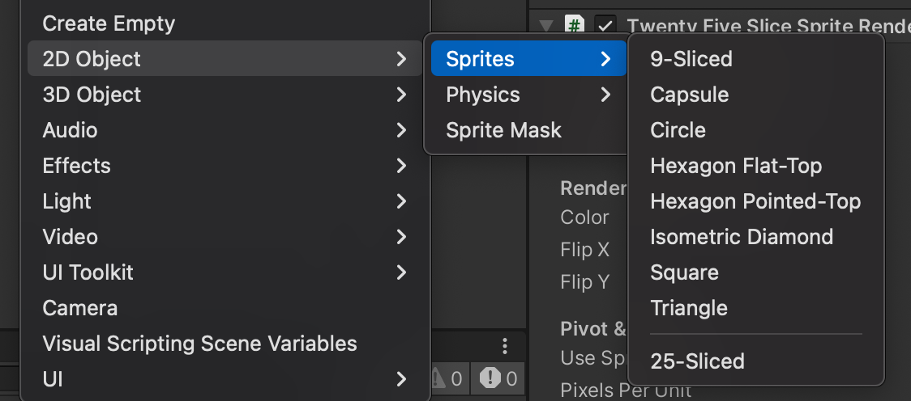
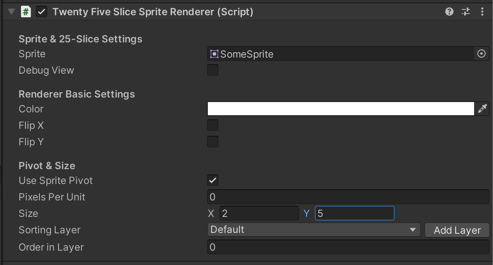

# 🚀 Announcing N-Slicer: The Evolution of TwentyFiveSlicer

📢 **New Release**: Beyond the open-source spirit of TwentyFiveSlicer, this enhanced solution is now available on the **Unity Asset Store**!
 
- [Purchase on Unity Asset Store](https://assetstore.unity.com/packages/slug/319511)
- [Visit the Official Website](https://www.nbeyond.dev/docs/nslicer)

**[N-Slicer](https://assetstore.unity.com/packages/slug/319511) is the next-generation sprite slicing solution, representing the technological advancement of TwentyFiveSlicer!**
 




While TwentyFiveSlicer evolved from 9-slice to 25-slice, N-Slicer takes it to the next level with **unlimited customizable slices**. Each slice can be individually configured as Fixed or Stretchable, enabling more sophisticated UI implementations.

---

# Twenty Five Slicer

[](https://openupm.com/packages/com.kwanjoong.twentyfiveslicer/)

**Twenty Five Slicer** is a Unity package designed for more advanced sprite slicing, enabling a "25-slice" approach. It divides a sprite into a 5x5 grid, allowing precise scaling and manipulation of individual regions while preserving key areas.

---

## 9-slice vs 25-slice

<p align="center">
  
</p>

---

## Key Concept

<p align="center">
  
</p>

- **9 slices**: Non-stretchable areas.
- **6 slices**: Stretch horizontally only.
- **6 slices**: Stretch vertically only.
- **4 slices**: Stretch in both directions.

This allows for far more detailed slicing. Where traditional 9-slice images often require stacking multiple image layers to achieve complex UI shapes (e.g., speech bubbles, boxes with icons or separators at the center), a 25-slice configuration can often handle these scenarios with just a single image.

---

## Installing the Package

### 1. Install via OpenUPM

#### 1.1. Install via Package Manager
Please follow the instructions:
1. Open **Edit → Project Settings → Package Manager**
2. Add a new Scoped Registry (or edit the existing OpenUPM entry)
  - **Name**: `package.openupm.com`
  - **URL**: `https://package.openupm.com`
3. Click **Save** or **Apply**
4. Open **Window → Package Manager**
5. Click the `+` button
6. Select **Add package by name...** (or **Add package from git URL...**)
7. Paste `com.kwanjoong.twentyfiveslicer` into **Name**
8. Paste a version (e.g., `1.1.2`) into **Version**
9. Click **Add**

---

#### 1.2. Alternatively, merge the snippet into `Packages/manifest.json`
```json
{
  "scopedRegistries": [
    {
      "name": "package.openupm.com",
      "url": "https://package.openupm.com",
      "scopes": []
    }
  ],
  "dependencies": {
    "com.kwanjoong.twentyfiveslicer": "1.1.2"
  }
}
```

---

#### 1.3. Install via command-line interface
```sh
openupm add com.kwanjoong.twentyfiveslicer
```

---

### 2. Install via Git URL

1. Open the Unity **Package Manager**.
2. Select **Add package from Git URL**.
3. Enter: `https://github.com/kwan3854/twentyfiveslicer.git`
4. To install a specific version, append a version tag, for example:  
   `https://github.com/kwan3854/twentyfiveslicer.git#v1.0.0`

---

## How to Use

### Create Slice Data Map (First-time Setup)

1. Navigate to the `Assets/Resources` folder. (Create it if it doesn't exist.)
2. Right-click → **Create → TwentyFiveSlicer → SliceDataMap**

<p align="center">
  
  
</p>

---

### Editing a Sprite

1. **Open the 25-Slice Editor**
  - **Window → 2D → 25-Slice Editor**

   <p align="center">
     
   </p>

2. **Load Your Sprite**
  - Drag and drop your sprite into the editor or select it via the provided field.

3. **Adjust the Slices**
  - Use the sliders to define horizontal and vertical cut lines, dividing the sprite into 25 sections.
  - Borders are displayed visually for accurate adjustments.

   <p align="center">
     
   </p>

4. **Save the Configuration**
  - Click **Save Borders** to store the 25-slice settings.

---

### Using the 25-Sliced Sprite

#### 1. Using with **UI (TwentyFiveSliceImage)**

This is the **UI** approach, similar to `UnityEngine.UI.Image`:
1. **Create a TwentyFiveSliceImage GameObject** or add `TwentyFiveSliceImage` to an existing **UI** element in a Canvas.
2. Assign your 25-sliced sprite to the `TwentyFiveSliceImage`.
3. Adjust the RectTransform size to see how each slice region scales or remains fixed.

<p align="center">
  
</p>
<p align="center">
  
</p>

#### 2. Using with **2D Scenes (TwentyFiveSliceSpriteRenderer)**

This is the **MeshRenderer**-based approach, similar to `SpriteRenderer`:
1. You can create a **25-Sliced Sprite** in the **Hierarchy**:
  - **Right-click → 2D Object → Sprites → 25-Sliced**  
    *This will instantiate a GameObject named `25-Sliced Sprite` with `TwentyFiveSliceSpriteRenderer` attached.*
2. In the Inspector, assign your 25-sliced sprite to its `Sprite` field.
3. Adjust the **Size** property in the Inspector (instead of using `transform.localScale`) to properly stretch or preserve corners/edges as needed.
4. **Sorting Layer** and **Order in Layer** are also available, just like a normal SpriteRenderer.

<p align="center">
  
</p>
<p align="center">
  
</p>

---

## Key Features

- Divide sprites into a 5x5 grid for highly detailed control.
- Seamlessly scale and stretch specific sprite regions.
- **UI approach** (`TwentyFiveSliceImage`) for usage in UGUI-based canvases.
- **2D Mesh approach** (`TwentyFiveSliceSpriteRenderer`) for usage in 2D scenes without UI.
- Compatible with Unity's 2D workflow, supports Sorting Layers.
- Intuitive editor window with clear visual guidance for precise adjustments.

---

## Delete Unused Data

You can remove slice data that is no longer needed:
**Tools → Twenty Five Slicer Tools → Slice Data Cleaner**

---

For more information or contributions, visit the [repository](https://github.com/kwan3854/TwentyFiveSlicer).
